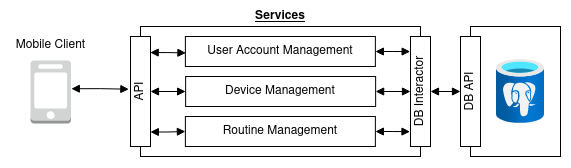

# SmartRoutine
SaaS application used to set routines for devices

## System Overview

### Services
* #### User Account Management  

    The User Account Management service is responsible for creating, modifying, and deleting user accounts and profiles. This service is also be responsible for user authentication.  

* #### Device Management  

    The Device Management service is responsible for creating, modifying, and deleting devices. It is also responsible for maintaining a device's configuration.  

* #### Routine Management  

    The Routine Management service is responsible for creating, modifying, and deleting routines. 